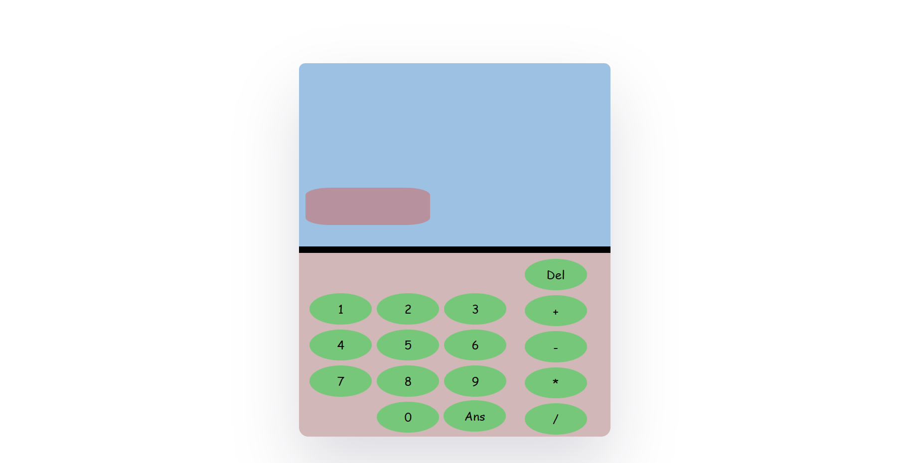

# Calculator Web App

This is a simple calculator web app built using HTML, CSS, and JavaScript.

## Preview



## Features

- Basic arithmetic operations: Addition, Subtraction, Multiplication, Division.
- Delete button to clear the input.
- Ans button to calculate the result.
- Responsive design for various screen sizes.

## Usage

1. Clone the repository:

   ```bash 
   1. git clone https://github.com/melan-variya/Calculator
   2. Open the `index.html` file in your preferred web browser.
   3. Start using the calculator.
## Dependencies
   No external dependencies are required. The application is built using HTML, CSS, and JavaScript.


